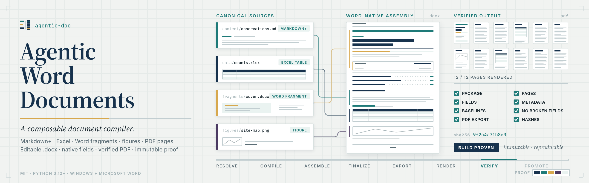
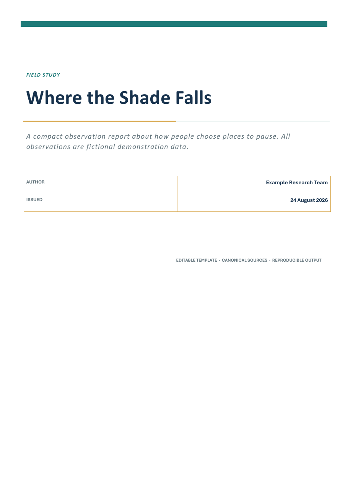
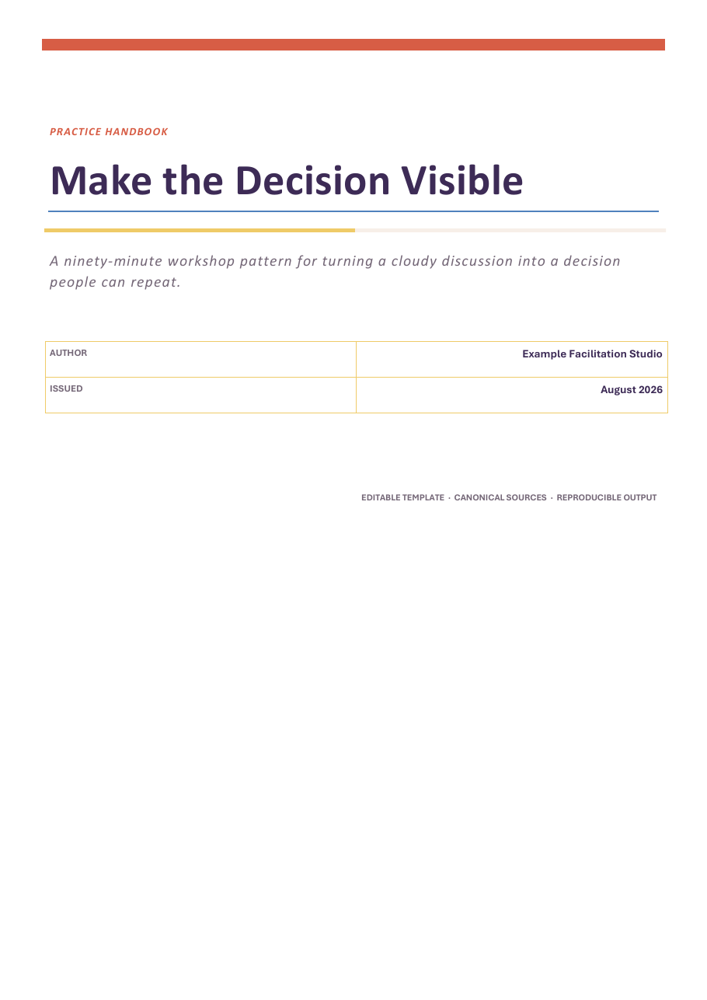
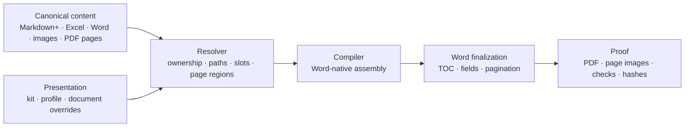

<p align="center">
  <picture>
    <source media="(prefers-color-scheme: dark)" srcset="docs/assets/banner-dark.gif">
    
  </picture>
</p>

# Agentic Word Documents

Keep each part of a document where it actually belongs, and get back an editable Word file plus a PDF you can prove is the document you meant to ship.

Write prose in Markdown+, maintain data in Excel, keep designed fragments in Word, and change covers, headers, footers, styles, or page regions independently. The compiler assembles those parts into an editable `.docx`, refreshes native Word fields, exports a PDF, renders every page, and records an auditable build report.

| Field-study report | Workshop handbook |
|---|---|
|  |  |
| [Open rendered sample](examples/rendered/field-study-report.pdf) | [Open rendered sample](examples/rendered/workshop-handbook.pdf) |

## What makes it different

- **Word stays native.** Headings, numbering, TOCs, tables, headers, footers, sections, and fields stay real Word structures, so whoever opens the file edits them the normal way.
- **Each thing has one owner.** Prose can belong to Markdown, a table to Excel, a worksheet to Word, and a diagram to its native drawing file. A build does not blur those boundaries.
- **Design is separate from content.** A kit owns the visual language, a profile owns document shape, a project supplies shared context, and a document picks what goes in and in what order. You can change one without disturbing the rest.
- **Tables are data, not schemas.** An Excel Table or explicit range can have any columns. The kit controls presentation without hardcoding a business-specific layout.
- **Iteration stays small.** Page-furniture proofs isolate covers, margins, headers, footers, and numbering. Quick builds replace heavy components with visible placeholders instead of doing needless final work.
- **Nothing ships unproven.** Every full build exports the PDF, renders every page, checks metadata and broken Word fields, fingerprints its inputs, and stores an immutable report.
- **Edits come back on purpose.** When a coworker edits the compiled Word file, you can compare their version against the canonical component and adopt the changes deliberately. Markdown stays one-way, by design.

## Compared with

Most of these convert a document once. This one is built for the part that takes the
time — getting a cover, a header, or the numbering right — so you can proof one piece
without rebuilding everything, and check the rendered pages afterwards.

| Compared with | Why use this | Use the other tool when |
| --- | --- | --- |
| [Pandoc](https://pandoc.org) `--to docx` | Word keeps live fields, a real generated TOC, headers, footers, and section structure, and every source keeps exactly one owner. Page furniture can be proofed on its own instead of rebuilding the document to check a header. | You want a single-command conversion and do not need those Word structures to survive. |
| [python-docx](https://github.com/python-openxml/python-docx) or [docxtpl](https://github.com/elapouya/python-docx-template) | You describe the document once in manifests instead of writing assembly code for each new document. | You are generating documents programmatically from application data. |
| [Quarto](https://quarto.org) or R Markdown | Word is the target rather than a fallback, the PDF comes out of Word's own layout engine, and the rendered pages are checked for blank pages and missing ink. | Your real output is a website or a paper, or you need executable code cells. |
| Word mail merge | Prose, data, designed fragments, and figures each stay in the tool that suits them. | You are filling one fixed template with rows from a list. |

## Five-minute start

Requirements: Windows, Microsoft Word desktop, Python 3.12+, and Poppler (`pdftoppm` plus `pdfinfo`) on `PATH` or in `AGENTIC_DOCS_POPPLER_BIN`.

```powershell
git clone <your-repository-url> agentic-word-documents-system
cd agentic-word-documents-system
powershell -ExecutionPolicy Bypass -File .\setup.ps1
.\Document-System.cmd documents
.\Document-System.cmd build shade-study
.\Document-System.cmd open shade-study --pdf
```

The everyday loop is deliberately small:

```powershell
.\Document-System.cmd workspace shade-study
.\Document-System.cmd edit shade-study
.\Document-System.cmd preview shade-study --presentation page-furniture
.\Document-System.cmd build shade-study --quick
.\Document-System.cmd build shade-study
.\Document-System.cmd audit shade-study
```

`preview --presentation page-furniture` makes a compact consecutive-page proof of the cover, margins, headers, footers, and numbering. `--quick` renders a lightweight Word/PDF pair and uses clear placeholders for heavy components. Neither path updates `current/` or passes the publishing gate. A full build compiles everything, renders every page, and runs the complete output checks.

For a guided first build, use [QUICKSTART.md](QUICKSTART.md).

The repository also includes a reviewed Codex skill at `skills/compose-word-documents`. It stays in the project until you choose to install it.

## The model



The generated Word file is a product, not the universal source. Edit the source that owns the thing you want to change:

| Change | Canonical place |
|---|---|
| paragraphs, headings, lists, callouts | Markdown+ file |
| maintained data table | Excel Table or explicit range |
| cover | document-level Word fragment |
| reusable header, footer, or style system | kit donor `.docx` |
| document sequence and page regions | document manifest |
| designed worksheet or form | Word fragment |
| reviewed illustration | image source |
| native diagram | drawing file plus accepted rendition |
| exact pages from a source publication | PDF plus explicit page selection |

## Included templates

The repository ships two deliberately different, fictional examples:

1. **Where the Shade Falls** — a restrained observation report using Markdown prose, an arbitrary Excel Table, a figure, a custom cover, a TOC, and formal page furniture.
2. **Make the Decision Visible** — a warmer practice handbook using Markdown prose, a schedule workbook, a designed Word worksheet, a process figure, and a different visual kit.

They are complete working projects under `projects/`, not screenshots or flattened samples. Their binary template assets are regenerated by `tools/build_template_assets.py`.

See [docs/TEMPLATES.md](docs/TEMPLATES.md) for how to clone or redesign them.

## Repository map

```text
kits/       reusable styles, headers, footers, and table themes
profiles/   document shells and field-binding contracts
projects/   canonical example projects and documents
schemas/    editor schemas for every JSONC manifest
src/        compiler and command-line implementation
scripts/    native Word finalization and PDF export helpers
tools/      reproducible template-asset generator and the README banner
tests/      unit and structural regression tests
docs/       concepts, authoring, configuration, architecture, and operations
skills/     companion Codex skill for document-engineering work
```

Runtime outputs are intentionally untracked:

```text
builds/       immutable build runs and proof artifacts
current/      convenient copy of the latest verified pair
operations/   append-only activity records
.cache/       disposable content-addressed adapters
archive/      recoverable retention moves
releases/     controlled release packages
```

## Learn the system

- [Concepts](docs/CONCEPTS.md) — the mental model and ownership rules
- [Authoring](docs/AUTHORING.md) — Markdown+, Excel, Word fragments, figures, diagrams, and PDF pages
- [Templates](docs/TEMPLATES.md) — the included examples and how to make your own
- [Configuration](docs/CONFIGURATION.md) — kits, profiles, manifests, regions, fields, and gates
- [AI workflows](docs/AI_WORKFLOWS.md) — safe, fast collaboration with an agent
- [Architecture](docs/ARCHITECTURE.md) — compiler stages, provenance, caching, and proof
- [Releases and recovery](docs/RELEASES_AND_RECOVERY.md) — builds, publishing, restoration, retention, and Word workcopies

## Design boundaries

This is not a browser renderer, a mail-merge tool, or a two-way Word-to-Markdown converter. It composes sources you already own into Word-native documents and keeps the right things editable in Word. Anything Markdown handles badly gets its own typed component instead of being flattened into prose.

## Project status

Current release is `0.2.0`. Both included examples build all the way through on Windows with Microsoft Word: DOCX, PDF, every page rendered, package validated, metadata and unexpected blank pages checked, and no broken Word fields left in the exported text.

## Related

Same idea, different job — one thing done properly, nothing in the middle,
and a result you can check:

- [FrankenMarkdown](https://github.com/mystxcal/frankenmarkdown) — Markdown to PDF in one binary, no LaTeX or browser
- [Flourite](https://github.com/mystxcal/flourite) — an agent harness for one hard task, with an auditable ledger

The rest are listed on [my profile](https://github.com/mystxcal).

See [CHANGELOG.md](CHANGELOG.md), [CONTRIBUTING.md](CONTRIBUTING.md), and [SECURITY.md](SECURITY.md). Licensed under the [MIT License](LICENSE).
