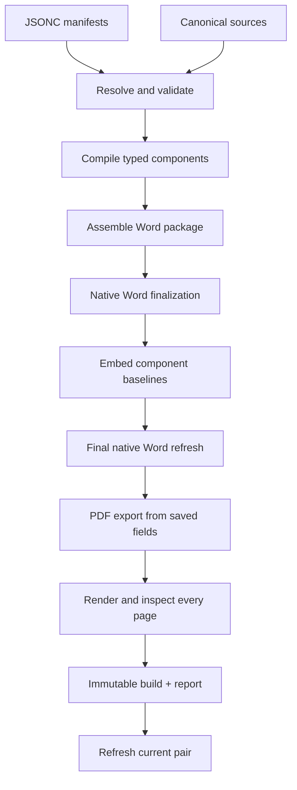

# Architecture

The compiler is a layered pipeline with explicit boundaries between authoring, Word automation, and proof.

It has two execution paths. A complete build compiles and proves the whole document. A scoped preview compiles only the content needed to judge the current change and is deliberately non-publishable.

## Pipeline



## 1. Resolution

The resolver loads the selected kit, profile, project, and document. It validates typed known fields while allowing deliberate project metadata extensions. Paths become absolute, scoped references are resolved, sources are hashed, slots are checked, and the complete ownership map becomes available before any output is changed.

Validation is separated from building:

```powershell
.\Document-System.cmd validate my-document
.\Document-System.cmd status my-document
.\Document-System.cmd explain my-document --component body
```

## 2. Typed component compilation

Each source passes through an adapter suited to its type:

- Markdown+ becomes style-native paragraphs, lists, tables, callouts, and insertion slots;
- Excel becomes a native Word table from an arbitrary Table or range;
- figures become normalized publication blocks;
- selected PDF pages become explicit page images;
- Word fragments are imported with their relationships, styles, and editable structures;
- diagrams use a reviewed rendition tied to their native-source revision.

Generated adapter fragments are cached by a content-addressed fingerprint that includes:

- source and related-source hashes;
- component declaration and options;
- selected style source and relevant kit configuration;
- available layout width;
- adapter implementation code signature;
- relevant external renderer identity.

The cache is disposable. A cache hit is accepted only after metadata, output hash, and DOCX package validation agree.

## 3. Word package assembly

The profile shell supplies stable structural anchors. Components are inserted in manifest sequence and nested components replace named slots. The assembly stage also applies:

- field bindings;
- core document properties;
- semantic styles;
- page-region margins and boundaries;
- header and footer donors;
- page numbering and regional page totals;
- media normalization;
- removal of unused page-furniture parts.

OOXML changes are package-aware: relationships, content types, numbering parts, styles, and media are copied or rewritten rather than pasted as raw XML fragments.

## 4. Native Word finalization

Microsoft Word performs the tasks for which it is the authoritative renderer: layout, TOC generation, page references, field results, and pagination.

The pipeline uses two saved Word passes around baseline embedding. The second pass also exports the finalized PDF in the same isolated Word session. This matters because TOC updates create bookmarks and `PAGEREF` fields that must survive the final package change. Markdown headings remain direct Word paragraphs with inline source tags; this preserves both source ownership and stable native TOC behavior.

Scoped previews use one isolated Word session to update fields, save the DOCX, and export the PDF. They skip component-baseline embedding and full-document comparison. This is a speed path with an explicit incomplete-content contract, not a weaker final build.

PDF export disables Word's machine-level “update fields at print” behavior. The exported PDF therefore represents the already-finalized saved document rather than a workstation-specific last-second field mutation.

## 5. Provenance and coworker baselines

Components are tagged in the compiled Word document. A full build embeds baseline states for adoptable components. When a coworker edits a compiled Word file, the system can distinguish:

- the canonical component at build time;
- the current canonical component;
- the component in the returned workcopy.

That three-way context prevents an edited workcopy from silently overwriting canonical changes. Adoption is deliberate and conflict-aware.

## 6. Proof

A full build records and checks:

- valid DOCX package relationships and parts;
- successful native field finalization;
- successful PDF export;
- PDF metadata title;
- all PDF pages rendered to images;
- known broken Word-field messages absent from extracted PDF text;
- unexpected blank pages absent unless the document explicitly permits them;
- component baselines embedded;
- source-governed layout preserved when applicable;
- unexplained output changes absent;
- error diagnostics absent.

The build report also records resolved layers, source hashes, component order, field bindings, page-furniture inventory, timing by stage, input changes, cache activity, structural comparison, visual comparison, and artifact hashes.

Every report declares `content_scope`, `complete_content`, `quality.scope_passed`, and `quality.release_ready`. A scoped proof may pass every check relevant to its scope while still reporting `release_ready: false`. Publishing rejects that distinction mechanically.

## Scoped preview design

- `preview --presentation page-furniture` replaces the body with a stable three-page fixture and exercises the real cover, page regions, headers, footers, margins, fields, and numbering.
- `preview --component ID` compiles one component subtree.
- `build --quick` compiles the full sequence while applying component preview policies. PDF-page components default to a visible placeholder.
- `--include-heavy` overrides deferral only when the heavy material itself is under review.

Word's different-first-page and odd/even settings are section-wide. The compiler deduplicates identical variant donors and inherits a default header or footer into a real sibling variant when necessary. This prevents blank parity pages and disappearing furniture.

## 7. Immutable promotion

A build is assembled in a hidden temporary run and promoted only after completion. The normal promotion is an atomic directory rename. Some Windows protected folders allow file writes but deny directory rename; in that case the engine performs a verified-copy fallback and compares the complete relative-path, size, and SHA-256 inventory before recognizing the destination as authoritative. The report records which method was used.

After an immutable run exists, `current/` is refreshed as a convenience. A failed current refresh does not invalidate the completed build.

## Failure philosophy

The engine distinguishes:

- **error diagnostics**, which make quality proof fail;
- **warnings**, which preserve a usable artifact but identify an unmet proof condition;
- **informational diagnostics**, such as verified cache reuse.

It does not conceal a missing runtime by manufacturing a PDF, nor call an unrendered document fully proven. Diagnostic builds can retain intermediates without turning those files into new sources.

## Extension points

The clean extension points are:

- a new component adapter;
- a new kit;
- a new profile;
- additional semantic table roles;
- additional manifest fields validated by model/schema;
- additional output checks.

Domain-specific facts, fixed spreadsheet columns, customer names, and one-off document rules do not belong in the compiler core.
