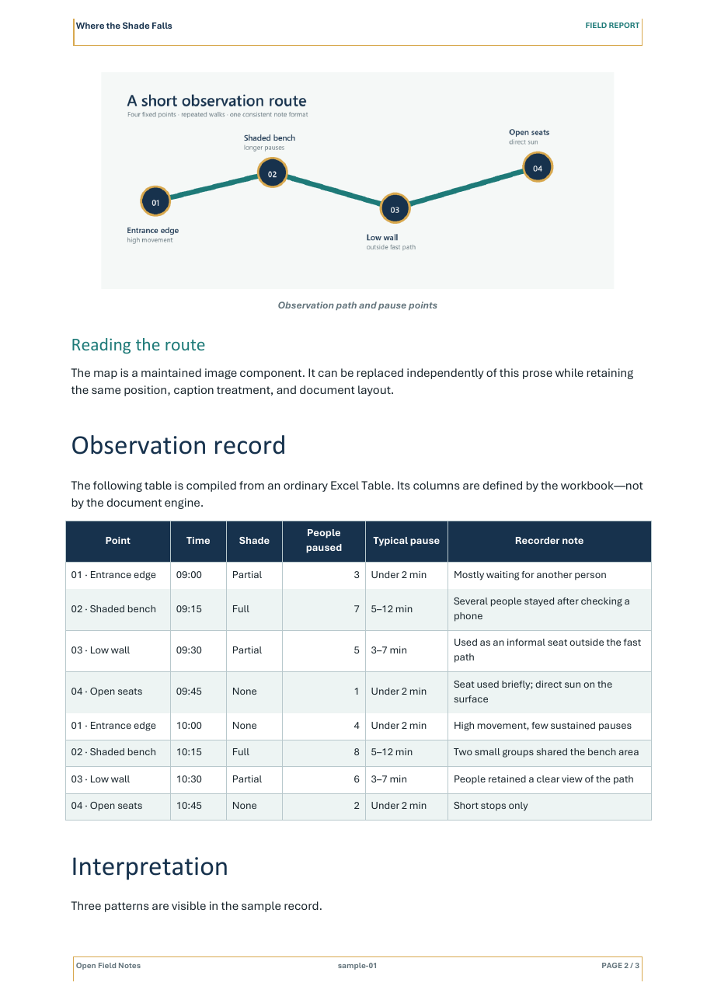
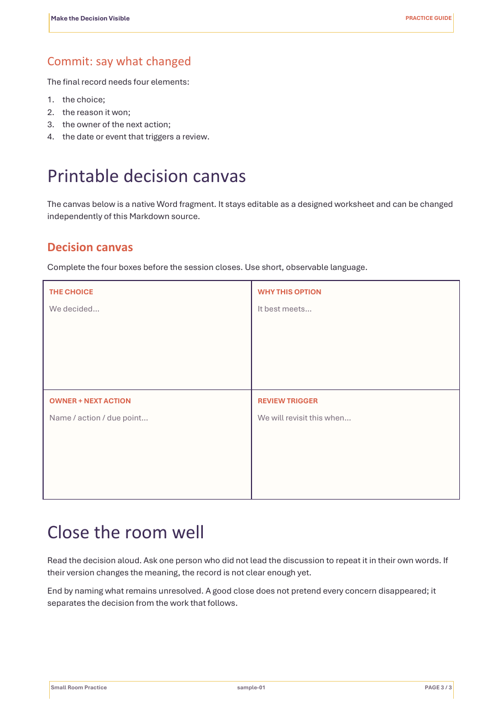

# Templates

The included templates demonstrate composition rather than prescribe a universal business format. Both are fictional and use neutral sample data.

## Template 1: observation report

Document ID: `shade-study`

Rendered output: [field-study-report.pdf](../examples/rendered/field-study-report.pdf)



This example demonstrates:

- restrained report typography;
- a custom Word cover;
- native TOC and page numbering;
- Markdown+ narrative;
- a figure inserted in the middle of prose;
- an arbitrary Excel Table whose columns come from the workbook;
- a cool studio-style header, footer, and table palette.

Canonical files live under:

```text
projects/field-study/
  project.jsonc
  documents/shade-study/
    document.jsonc
    content/body.md
    content/observations.xlsx
    content/study-map.png
    presentation/cover.docx
```

## Template 2: workshop handbook

Document ID: `clear-decisions`

Rendered output: [workshop-handbook.pdf](../examples/rendered/workshop-handbook.pdf)



This example demonstrates:

- a warmer editorial visual system;
- Markdown+ prose and callouts;
- an Excel-maintained run of show;
- a process figure;
- a designed, editable Word worksheet inserted inside the prose flow;
- a different profile and kit without a separate compiler.

Canonical files live under:

```text
projects/workshop-kit/
  project.jsonc
  documents/clear-decisions/
    document.jsonc
    content/body.md
    content/run-of-show.xlsx
    content/session-map.png
    content/decision-canvas.docx
    presentation/cover.docx
```

## Safest way to start

Use the CLI to create a new collection and document rather than copying paths blindly:

```powershell
.\Document-System.cmd new project learning-notes --name 'Learning Notes'
.\Document-System.cmd new document field-journal `
  --project learning-notes `
  --title 'Field Journal' `
  --type 'Journal' `
  --profile report `
  --kit studio `
  --date 2026-08-24
```

Then selectively borrow patterns from the examples:

- copy a component declaration only when you are also adding the corresponding source;
- keep IDs unique within the document;
- place each child component through a declared Markdown slot;
- use project-neutral file names;
- update metadata and output basename;
- validate before building.

## Redesigning a template

Design is split so each lever has a clear blast radius.

### Change one document's cover

Edit its document-level cover fragment:

```powershell
.\Document-System.cmd edit my-document --presentation cover
```

### Change a reusable visual system

Create a new kit rather than editing a shipped kit in place. Copy one kit folder, rename its `id`, and edit:

- `Style_Gallery.docx` for semantic paragraph and character styles;
- `Running_Header.docx` for the reusable header;
- `Folio_Footer.docx` for the reusable footer;
- `kit.jsonc` for semantic style names and table roles.

Documents opt into the new kit through their manifest. This makes redesign reversible and prevents unrelated documents from changing unexpectedly.

### Change document shape

Create or copy a profile when the structural contract changes: shell, body slot, page-region boundary, metadata bindings, or release gates. Do not create a profile merely because one document has a different title or cover.

## Regenerating the shipped binary assets

The sample donors, shells, figures, workbooks, covers, and Word worksheet are generated by:

```powershell
python .\tools\build_template_assets.py
.\Document-System.cmd schema
.\Document-System.cmd build shade-study
.\Document-System.cmd build clear-decisions
```

The Markdown and JSONC files remain human-authored. The generator owns only binary template assets and synthetic sample data.

## Template quality checklist

Before sharing a new template:

- build it from a fresh checkout;
- confirm no private names, paths, logos, metadata, or sample facts remain;
- update fields through the normal build, not manually;
- inspect every rendered page at normal reading scale;
- inspect dense pages, page transitions, tables, captions, headers, and footers;
- check that the PDF has no broken field text;
- run the complete test suite;
- publish only canonical sources and intentional rendered examples, not runtime build history.
